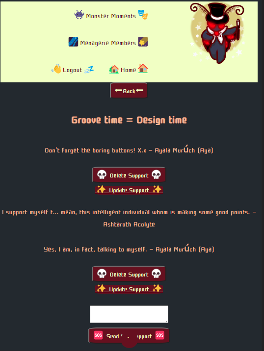
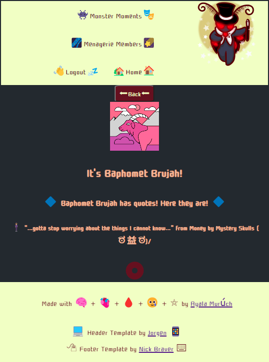

#### Express Moments of Monstrous Memories and Emotions!

---

#### Share Your Favorite Personal Motivational Quotes!

---

# MeMoMoMaMe - Menagerie of Motivations and Monster Making Messages!

---

### Description: 

  This small app allows interaction in 3 simple ways: Create, update, or delete a 'Monster Moment' (a big event or emotion) without other users knowing who you are, read and/or reply to someone else's 'Monster Moment', and add and remove quotes from your profile page! It's that easy! (Works best with mobile apps as of 1/20/2023)

---

---

## 🪦 Getting Started:
---

##  [Click Here to Try Out MeMoMoMaMe!](https://memomomame.fly.dev/ "link to game")

---
---

## 🩻 Links to Project Planning Materials:
---

*  [Whimsical](https://whimsical.com/mobile-layout-EZLMTro4zcMVuZXmJQUHnr "link to Whimsical")
  
*  [Trello](https://trello.com/b/S4tx9oN0/memomomame "link to Trello")

---
---

## 📜 Credits:

---

*  Header Template created by: [Jorgen!](https://codepen.io/jorgenb/pen/BPgmoq "link to Jorgen's code")

*  Footer Template created by: [Nick Braver!](https://codepen.io/nickbraver/pen/DGeMWQ "link to Nick Braver's code")

*  Color Palette Picker at: [Coolors.co!](https://coolors.co/ "link to color palette picker")

*  Emoji List at: [Unicode!](https://unicode.org/emoji/charts/full-emoji-list.html "link to Unicode emoji list")

*  Google Font 'Cute' by: [TypoDesign Lab, Inc!](https://fonts.google.com/specimen/Cute+Font "link to 'Cute' font on Google fonts")

*  Deployed through: [Fly.io!](https://fly.io/ "link to Fly.io")

*  Stored and Updated on: [Github!](https://github.com/ "link to Github")

---
---

## 🎭	Technologies Used:

---
*  Express ejs

*  MondoDB

*  CSS

*  HTML

*  Mongoose

*  NPM

*  Markdown
	
*  Google OAuth

---
---

## 🔮 Icebox
---

[]   Edit and update quotes

[]  Add array of monster images to choose from and custom emojis

[]  Sorting by date, posts and replies

[]  Allow the poster to choose whether or not replies can be add to their post

[]  Allow for replies to link to user's profile

[]  Navigation menu update

[]  UI update

---
---

## [Click Here to Try Out MeMoMoMaMe!](https://memomomame.fly.dev/ "link to game")

---